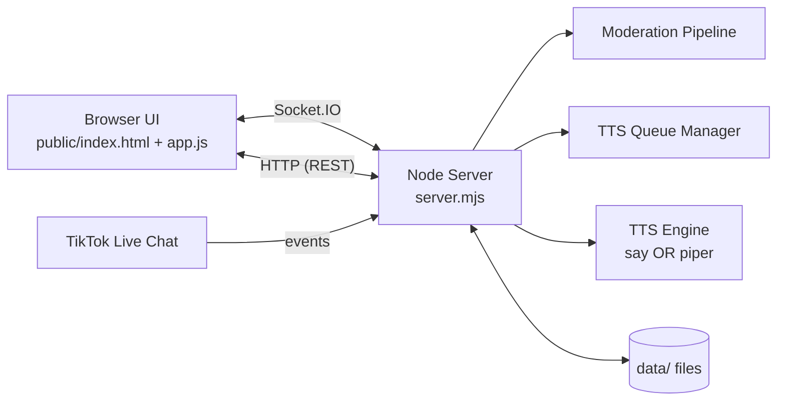
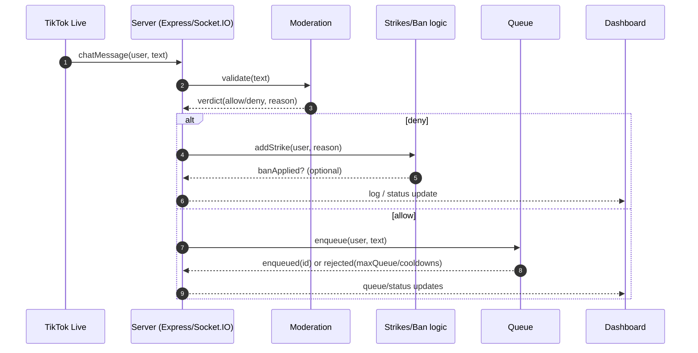
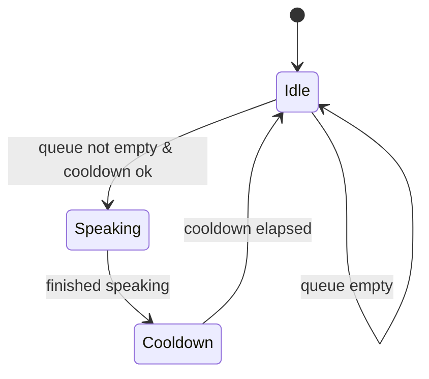
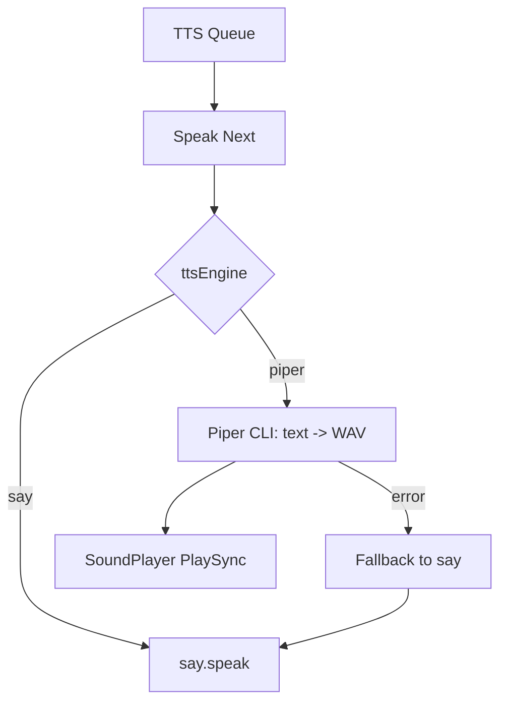

# TikTok TTS Dashboard (Local) — Technical Report

Aplicación **local** en Node.js que se conecta al chat de **TikTok Live**, modera mensajes, administra una **cola de TTS**, y expone un **dashboard web local** para control y monitoreo. Pensada para **Windows 11**: servidor (Express + Socket.IO) + UI estática.

> **Alcance:** todo corre en tu PC. No hay almacenamiento remoto.

## Tabla de contenido

* [Características](#características)
* [Arquitectura](#arquitectura)
* [Estructura del proyecto](#estructura-del-proyecto)
* [Requisitos](#requisitos)
* [Ejecución local](#ejecución-local)
* [Configuración](#configuración)
* [Moderación](#moderación)
* [Cola TTS](#cola-tts)
* [Piper (motor TTS opcional)](#piper-motor-tts-opcional)

  * [Piper Quick Start](#piper-quick-start-sin-fallos)
  * [Instalación de Piper (Windows 11)](#instalación-de-piper-windows-11)
  * [Descargar un modelo de voz](#descargar-un-modelo-de-voz)
  * [Smoke test (prueba rápida)](#smoke-test-prueba-rápida)
  * [Configurar Piper en el dashboard](#configurar-piper-en-el-dashboard)
  * [Errores comunes](#errores-comunes)
* [API HTTP](#api-http)
* [Socket.IO](#socketio)
* [UI (Dashboard)](#ui-dashboard)
* [Debug en VS Code](#debug-en-vs-code)
* [Notas y troubleshooting](#notas-y-troubleshooting)
* [Roadmap](#roadmap)

## Características

* Ingesta de chat de TikTok Live (conectar/desconectar bajo demanda)
* Pipeline de moderación:

  * badwords (exactos y por substring)
  * filtros anti-spam, URLs, menciones
  * allowlist de caracteres
* Strikes por usuario + **auto-ban** opcional
* Cola TTS con cooldown global y por usuario
* Ban/unban manual + edición de listas
* Dashboard local con Tailwind UI, dark mode y estado en vivo
* Inyección de mensajes de prueba y “skip” de cola
* Editor de settings en runtime (cooldowns, límites, auto-ban, voz/rate)
* **Motor TTS configurable:** `say` (default) o **`piper` (opcional)** con fallback automático a `say` si Piper falla

## Arquitectura

### Componentes principales

* **Backend:** `server.mjs` (Express + Socket.IO)
* **Frontend:** `public/index.html`, `public/app.js` (UI estática + Socket.IO client)
* **Persistencia local:** archivos JSON/TXT en `data/`

### Diagrama de componentes (UML / Mermaid)



## Estructura del proyecto

```text
/
├─ server.mjs
├─ public/
│  ├─ index.html
│  └─ app.js
└─ data/
   ├─ settings.json
   ├─ banned_users.json
   ├─ badwords_exact_es.txt
   └─ badwords_substring_es.txt
```

> Si usas Piper, se recomienda crear:

```text
data/piper/
  <modelo>.onnx
  <modelo>.onnx.json
```

## Requisitos

* Windows 10/11 (orientado a Windows 11)
* Node.js **18+** (probado con Node 25)
* Nombre de usuario de TikTok (para conectar a Live)

**Para Piper (opcional):**

* **Python 3.12 o 3.13 x64** (recomendado)
* Paquete `piper-tts` instalado (idealmente en un venv del proyecto)
* Modelo de voz Piper (**siempre** `.onnx` + `.onnx.json`)

## Ejecución local

```bash
npm install
node server.mjs
```

Dashboard (por defecto): `http://127.0.0.1:8787`

> Si cambias `bindHost` a `0.0.0.0`, el dashboard quedará accesible desde tu red local (implica riesgo si no lo proteges).

## Configuración

### Archivo principal: `data/settings.json`

Ejemplo (con defaults + Piper):

```json
{
  "tiktokUsername": "TU_USUARIO_SIN_ARROBA",
  "bindHost": "127.0.0.1",
  "port": 8787,

  "ttsEnabled": true,
  "ttsEngine": "say",

  "globalCooldownMs": 9000,
  "perUserCooldownMs": 30000,
  "maxQueue": 6,
  "maxChars": 80,
  "maxWords": 14,

  "ttsVoice": "",
  "ttsRate": 1.0,

  "piper": {
    "pythonCmd": "",
    "modelPath": "",
    "lengthScale": 1.0,
    "volume": 1.0
  },

  "autoBan": {
    "enabled": true,
    "strikeThreshold": 2,
    "banMinutes": 30
  }
}
```

> Nota: los campos `ttsVoice/ttsRate` aplican principalmente a `say`. Para Piper se usan los campos dentro de `piper`.

### Campos (resumen)

* **tiktokUsername:** usuario sin `@`
* **bindHost / port:** binding del servidor local
* **ttsEnabled:** habilita/deshabilita salida de voz
* **ttsEngine:** `"say"` o `"piper"`
* **globalCooldownMs:** cooldown global entre lecturas
* **perUserCooldownMs:** cooldown por usuario
* **maxQueue:** tamaño máximo de cola
* **maxChars / maxWords:** límites del mensaje a encolar
* **ttsVoice / ttsRate:** (principalmente `say`) selección de voz y velocidad
* **piper.***: (solo `piper`) configuración de CLI/modelo
* **autoBan:** configuración de strikes y ban automático

> Recomendación: trata `data/` como “estado” de la app. Editar a mano es posible, pero idealmente se gestiona desde el dashboard.

## Moderación

### Objetivo

Evitar que contenido no deseado llegue a TTS (spam, enlaces, menciones, ofuscación de insultos, etc.) y aplicar strikes/bans.

### Reglas (resumen)

* **Bloqueo de URLs:** detecta `http`, `www` y TLDs comunes
* **Bloqueo de menciones:** patrones tipo `@usuario`
* **Spam:** repetición excesiva de caracteres o puntuación
* **Allowlist:** solo letras latinas, números, espacios y puntuación básica
* **Bad words:**

  * **Exact match** por token (palabra)
  * **Substring** sobre tokens unidos (anti-ofuscación)

### Diagrama de secuencia (UML / Mermaid)



## Cola TTS

### Comportamiento

* **Cap** por `maxQueue`
* Respeta:

  * `globalCooldownMs` (entre lecturas)
  * `perUserCooldownMs` (entre mensajes del mismo usuario)
* Motor TTS configurable:

  * `say` (por defecto)
  * `piper` (opcional)
* **Skip manual**: elimina un mensaje en cola por `id`

### Estado típico (diagrama de estados)



## Piper (motor TTS opcional)

Piper está integrado como motor alternativo. Se invoca mediante **Piper CLI** para generar un **WAV**, y luego se reproduce en Windows con **SoundPlayer**. Si Piper falla por cualquier razón (comando inexistente, modelo inválido, error de ejecución), el servidor hace **fallback automático a `say`** para no interrumpir la cola.

### Cambios principales (implementación)

* Motor TTS configurable + Piper CLI (WAV + SoundPlayer) en `server.mjs`
* Nuevos campos de Piper en el panel lateral **Opciones → TTS** (`public/index.html`)
* Lógica UI para mostrar/ocultar ajustes de Piper y guardar en runtime (`public/app.js`)
* Defaults persistidos en `data/settings.json`

### Piper Quick Start

Para usar Piper en Windows se requieren **3 cosas**:

1. **Piper instalado** (`piper-tts`)
2. **Modelo descargado** (**siempre** `.onnx` + `.onnx.json`)
3. **`pythonCmd` correcto** (debe apuntar al Python que tiene Piper instalado)

✅ **Regla de oro:** **NO uses `py`** como `pythonCmd`.
`py` (Python Launcher) normalmente ejecuta el Python global y puede **ignorar el venv**, causando errores tipo “no se encuentra Piper” aunque sí esté instalado.

**Configuración recomendada:**

* `pythonCmd`: `.\.venv\Scripts\python.exe`
* `modelPath`: `.\data\piper\<modelo>.onnx`

### Instalación de Piper (Windows 11)

#### 1) Usar Python compatible (recomendado 3.12 o 3.13)

> Evita Python “bleeding edge” (ej. 3.14), ya que dependencias como `onnxruntime` pueden no tener wheels disponibles.

Crea y activa un venv en la carpeta del proyecto:

```powershell
py -3.13 -m venv .venv
.\.venv\Scripts\Activate.ps1
python -V
```

#### 2) Instalar Piper

```powershell
python -m pip install --upgrade pip
python -m pip install piper-tts
```

Verifica:

```powershell
python -m piper --help
```

### Descargar un modelo de voz

Piper requiere **dos archivos** por voz. Si falta el `.onnx.json`, la síntesis fallará.

1. Crea carpeta recomendada:

```powershell
mkdir .\data\piper -Force | Out-Null
```

2. Ejemplo de descarga (es_MX-claude-high):

```powershell
Invoke-WebRequest `
  -Uri "https://huggingface.co/rhasspy/piper-voices/resolve/main/es/es_MX/claude/high/es_MX-claude-high.onnx" `
  -OutFile ".\data\piper\es_MX-claude-high.onnx"

Invoke-WebRequest `
  -Uri "https://huggingface.co/rhasspy/piper-voices/resolve/main/es/es_MX/claude/high/es_MX-claude-high.onnx.json" `
  -OutFile ".\data\piper\es_MX-claude-high.onnx.json"
```

3. Verifica:

```powershell
Test-Path .\data\piper\es_MX-claude-high.onnx
Test-Path .\data\piper\es_MX-claude-high.onnx.json
```

Ambos deben dar `True`.

### Smoke test (prueba rápida)

Antes de configurar el dashboard, valida que Piper + modelo funcionan:

```powershell
"Hola desde Piper" | .\.venv\Scripts\python.exe -m piper `
  -m ".\data\piper\es_MX-claude-high.onnx" `
  -f ".\data\piper\test.wav"

(New-Object System.Media.SoundPlayer ".\data\piper\test.wav").PlaySync()
```

Si escuchas el WAV, Piper está listo.

### Configurar Piper en el dashboard

1. Inicia el servidor:

```powershell
node server.mjs
```

2. Abre el dashboard y ve a **Opciones → TTS**:

* **Motor:** `Piper`
* **Modelo (.onnx):** `.\data\piper\es_MX-claude-high.onnx`
* **Length scale:** controla la velocidad (Piper):

  * `1.0` normal
  * `> 1.0` más lento
  * `< 1.0` más rápido
* **Volumen:** `1.0` recomendado
* **Python cmd (IMPORTANTE):** `.\.venv\Scripts\python.exe`

3. Guarda opciones (persisten en `data/settings.json`).

4. Prueba con mensaje de prueba (UI o `/api/queue/test`).

> Nota: el campo **Velocidad (0.5–2.0)** suele corresponder a `say`. En Piper, la velocidad práctica se ajusta con **Length scale**.

### Errores comunes

#### 1) Piper no habla y `modelPath` está vacío

✅ Solución: configura el modelo `.onnx` en Opciones → TTS y asegúrate de tener también el `.onnx.json`.

#### 2) El modelo no existe

✅ Solución: descarga ambos archivos y verifica con `Test-Path`.

#### 3) `pythonCmd` = `py` y “no encuentra Piper”

✅ Solución: usa la ruta del Python del venv:

* `.\.venv\Scripts\python.exe`

#### 4) Piper falla y el sistema “vuelve” a say

Esto es esperado: existe **fallback automático a `say`** para no romper la cola. Revisa logs para ver el motivo del fallo (cmd/modelo).

### Diagrama de selección de motor (Mermaid)



## API HTTP

Base: `http://127.0.0.1:8787`

> Convención recomendada: todas las rutas `/api/*` devuelven JSON.

### Status

* `GET /api/status`

  * `{ ttsEnabled, speaking, queueSize }`

### Queue

* `POST /api/queue/clear`
* `POST /api/queue/skip` body: `{ id }`
* `POST /api/queue/test` body: `{ uniqueId, nickname, text, count }`

  * Encola mensajes de prueba (`count` de **1..50**)

**Ejemplo (PowerShell):**

```powershell
Invoke-RestMethod -Method Post `
  -Uri "http://127.0.0.1:8787/api/queue/test" `
  -ContentType "application/json" `
  -Body (@{
    uniqueId="test_user_1"
    nickname="Tester"
    text="Hola desde test"
    count=3
  } | ConvertTo-Json)
```

### Bans

* `GET /api/bans`
* `POST /api/ban` body: `{ uniqueId, minutes, reason }`
* `POST /api/unban` body: `{ uniqueId }`

### Lists

* `GET /api/lists`
* `POST /api/lists` body: `{ exact, sub }`

  * `exact`: contenido para `badwords_exact_es.txt`
  * `sub`: contenido para `badwords_substring_es.txt`

### TikTok

* `GET /api/tiktok/status`
* `POST /api/tiktok/connect`
* `POST /api/tiktok/disconnect`

### Settings

* `GET /api/settings`
* `POST /api/settings` (campos esperados)

  * `globalCooldownMs`, `perUserCooldownMs`, `maxQueue`, `maxChars`, `maxWords`
  * `ttsRate` (0.5..2.0), `ttsVoice`
  * `ttsEngine` (`say`/`piper`) y campos `piper.*` si aplica
  * `autoBanEnabled`, `autoBanStrikeThreshold`, `autoBanBanMinutes`

### TTS Voices

* `GET /api/tts/voices`

  * Usa `say.getInstalledVoices`
  * Fallback en Windows vía `System.Speech`

## Socket.IO

### Eventos emitidos hacia el cliente

* `status` — estado general (TTS on/off, speaking, etc.)
* `queue` — estado/elementos en cola
* `bansUpdated` — cambios en lista de bans
* `listsUpdated` — cambios en badwords
* `settings` — settings actuales
* `tiktokStatus` — estado de conexión a Live
* `logBulk` — lote de eventos recientes
* `log` — evento individual

> Recomendación: documenta el “shape” de cada payload si lo tienes estable. Al menos `queue` debe incluir `id` porque `/api/queue/skip` lo requiere.

## UI (Dashboard)

Controles principales:

* Toggle TTS
* Connect / Disconnect TikTok
* Clear queue
* Skip por mensaje (clic en texto u opción “Omitir”)
* Ban/unban manual
* Edición de listas (exact/sub)
* Inserción de mensajes de prueba (con repetición)
* Panel de opciones:

  * cooldowns, límites, auto-ban
  * motor TTS (`say`/`piper`)
  * voz/rate (`say`) o modelo/lengthScale/volumen/pythonCmd (Piper)

## Debug en VS Code

Archivo: `.vscode/launch.json`

* **Server: Node** → ejecuta solo backend
* **App: Server + Client** → backend + Chrome

## Notas y troubleshooting

### No hay audio / no habla

* Verifica que **`ttsEnabled`** esté `true`

Si estás en **`say`**:

* Revisa voces instaladas (SAPI) y lista en `/api/tts/voices`
* Si `ttsVoice` está vacío, usa la voz por defecto del sistema

Si estás en **`piper`**:

* Verifica `piper.modelPath` (y que exista el `.onnx.json`)
* Verifica `piper.pythonCmd` (ideal: `.\.venv\Scripts\python.exe`, evitar `py`)
* Ejecuta el [Smoke test](#smoke-test-prueba-rápida)

### El puerto está ocupado

* Cambia `port` en `settings.json` o libera `127.0.0.1:8787`

### No conecta a TikTok Live

* Confirma `tiktokUsername` sin `@`
* Revisa que el live esté activo y que tu red no bloquee la conexión
* Observa `tiktokStatus` y logs en el dashboard

### Seguridad

* Por defecto usa `127.0.0.1` (solo local).
* Si expones `bindHost=0.0.0.0`, considera:

  * firewall
  * autenticación (si algún día la agregas)
  * evitar usarlo en redes públicas

## Roadmap

* Perfiles/presets de settings
* Allowlist de usuarios (mods)
* Toggle de filtrado de emojis
* Export/import de configuración
