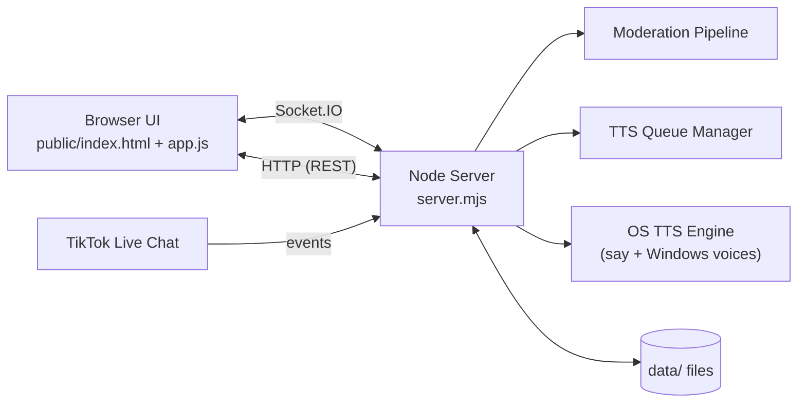
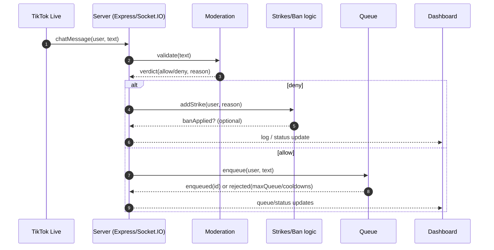
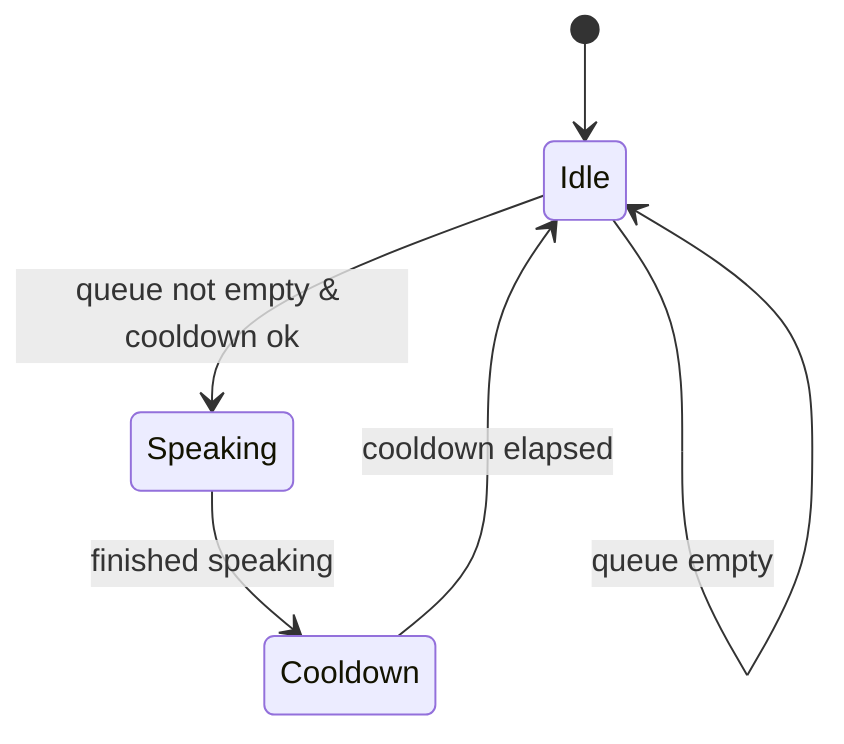

# TikTok TTS Dashboard (Local) — Technical Report

Aplicación **local** en Node.js que se conecta al chat de **TikTok Live**, modera mensajes, administra una **cola de TTS**, y expone un **dashboard web local** para control y monitoreo. Pensada para **Windows 11**: servidor (Express + Socket.IO) + UI estática.

> **Alcance:** todo corre en tu PC. No hay almacenamiento remoto.

## Tabla de contenido

* [Características](#características)
* [Arquitectura](#arquitectura)
* [Estructura del proyecto](#estructura-del-proyecto)
* [Requisitos](#requisitos)
* [Ejecución local](#ejecución-local)
* [Configuración](#configuración)
* [Moderación](#moderación)
* [Cola TTS](#cola-tts)
* [API HTTP](#api-http)
* [Socket.IO](#socketio)
* [UI (Dashboard)](#ui-dashboard)
* [Debug en VS Code](#debug-en-vs-code)
* [Notas y troubleshooting](#notas-y-troubleshooting)
* [Roadmap](#roadmap)

## Características

* Ingesta de chat de TikTok Live (conectar/desconectar bajo demanda)
* Pipeline de moderación:

  * badwords (exactos y por substring)
  * filtros anti-spam, URLs, menciones
  * allowlist de caracteres
* Strikes por usuario + **auto-ban** opcional
* Cola TTS con cooldown global y por usuario
* Ban/unban manual + edición de listas
* Dashboard local con Tailwind UI, dark mode y estado en vivo
* Inyección de mensajes de prueba y “skip” de cola
* Editor de settings en runtime (cooldowns, límites, auto-ban, voice/rate)

## Arquitectura

### Componentes principales

* **Backend:** `server.mjs` (Express + Socket.IO)
* **Frontend:** `public/index.html`, `public/app.js` (UI estática + Socket.IO client)
* **Persistencia local:** archivos JSON/TXT en `data/`

### Diagrama de componentes (UML / Mermaid)



## Estructura del proyecto

```text
/
├─ server.mjs
├─ public/
│  ├─ index.html
│  └─ app.js
└─ data/
   ├─ settings.json
   ├─ banned_users.json
   ├─ badwords_exact_es.txt
   └─ badwords_substring_es.txt
```

## Requisitos

* Windows 10/11 (orientado a Windows 11)
* Node.js **18+** (probado con Node 25)
* Nombre de usuario de TikTok (para conectar a Live)

## Ejecución local

```bash
npm install
node server.mjs
```

Dashboard (por defecto): `http://127.0.0.1:8787`

> Si cambias `bindHost` a `0.0.0.0`, el dashboard quedará accesible desde tu red local (implica riesgo si no lo proteges).

## Configuración

### Archivo principal: `data/settings.json`

Ejemplo (con defaults):

```json
{
  "tiktokUsername": "TU_USUARIO_SIN_ARROBA",
  "bindHost": "127.0.0.1",
  "port": 8787,
  "ttsEnabled": true,
  "globalCooldownMs": 9000,
  "perUserCooldownMs": 30000,
  "maxQueue": 6,
  "maxChars": 80,
  "maxWords": 14,
  "ttsVoice": "",
  "ttsRate": 1.0,
  "autoBan": {
    "enabled": true,
    "strikeThreshold": 2,
    "banMinutes": 30
  }
}
```

### Campos (resumen)

* **tiktokUsername:** usuario sin `@`
* **bindHost / port:** binding del servidor local
* **ttsEnabled:** habilita/deshabilita salida de voz
* **globalCooldownMs:** cooldown global entre lecturas
* **perUserCooldownMs:** cooldown por usuario
* **maxQueue:** tamaño máximo de cola
* **maxChars / maxWords:** límites del mensaje a encolar
* **ttsVoice / ttsRate:** selección de voz y velocidad
* **autoBan:** configuración de strikes y ban automático

> Recomendación: trata `data/` como “estado” de la app. Editar a mano es posible, pero idealmente se gestiona desde el dashboard.

## Moderación

### Objetivo

Evitar que contenido no deseado llegue a TTS (spam, enlaces, menciones, ofuscación de insultos, etc.) y aplicar strikes/bans.

### Reglas (resumen)

* **Bloqueo de URLs:** detecta `http`, `www` y TLDs comunes
* **Bloqueo de menciones:** patrones tipo `@usuario`
* **Spam:** repetición excesiva de caracteres o puntuación
* **Allowlist:** solo letras latinas, números, espacios y puntuación básica
* **Bad words:**

  * **Exact match** por token (palabra)
  * **Substring** sobre tokens unidos (anti-ofuscación)

### Diagrama de secuencia (UML / Mermaid)



## Cola TTS

### Comportamiento

* **Cap** por `maxQueue`
* Respeta:

  * `globalCooldownMs` (entre lecturas)
  * `perUserCooldownMs` (entre mensajes del mismo usuario)
* El TTS se ejecuta vía **`say`** (voz y rate configurables)
* **Skip manual**: elimina un mensaje en cola por `id`

### Estado típico (diagrama de estados)



## API HTTP

Base: `http://127.0.0.1:8787`

> Convención recomendada: todas las rutas `/api/*` devuelven JSON. (Si en tu implementación hay endpoints que devuelven texto, documéntalo aquí.)

### Status

* `GET /api/status`

  * Respuesta: `{ ttsEnabled, speaking, queueSize }`

### Queue

* `POST /api/queue/clear`
* `POST /api/queue/skip` body: `{ id }`
* `POST /api/queue/test` body: `{ uniqueId, nickname, text, count }`

  * Encola mensajes de prueba (`count` de **1..50**)

**Ejemplo (PowerShell):**

```powershell
Invoke-RestMethod -Method Post `
  -Uri "http://127.0.0.1:8787/api/queue/test" `
  -ContentType "application/json" `
  -Body (@{
    uniqueId="test_user_1"
    nickname="Tester"
    text="Hola desde test"
    count=3
  } | ConvertTo-Json)
```

### Bans

* `GET /api/bans`
* `POST /api/ban` body: `{ uniqueId, minutes, reason }`
* `POST /api/unban` body: `{ uniqueId }`

### Lists

* `GET /api/lists`
* `POST /api/lists` body: `{ exact, sub }`

  * `exact`: contenido para `badwords_exact_es.txt`
  * `sub`: contenido para `badwords_substring_es.txt`

### TikTok

* `GET /api/tiktok/status`
* `POST /api/tiktok/connect`
* `POST /api/tiktok/disconnect`

### Settings

* `GET /api/settings`
* `POST /api/settings` (campos esperados)

  * `globalCooldownMs`, `perUserCooldownMs`, `maxQueue`, `maxChars`, `maxWords`
  * `ttsRate` (0.5..2.0), `ttsVoice`
  * `autoBanEnabled`, `autoBanStrikeThreshold`, `autoBanBanMinutes`

### TTS Voices

* `GET /api/tts/voices`

  * Usa `say.getInstalledVoices`
  * Fallback en Windows vía `System.Speech`

## Socket.IO

### Eventos emitidos hacia el cliente

* `status` — estado general (TTS on/off, speaking, etc.)
* `queue` — estado/elementos en cola
* `bansUpdated` — cambios en lista de bans
* `listsUpdated` — cambios en badwords
* `settings` — settings actuales
* `tiktokStatus` — estado de conexión a Live
* `logBulk` — lote de eventos recientes
* `log` — evento individual

> Recomendación: documenta en esta sección el “shape” de cada payload (campos) si lo tienes estable. Al menos `queue` debe incluir `id` porque `/api/queue/skip` lo requiere.

## UI (Dashboard)

Controles principales:

* Toggle TTS
* Connect / Disconnect TikTok
* Clear queue
* Skip por mensaje (clic en texto u opción “Omitir”)
* Ban/unban manual
* Edición de listas (exact/sub)
* Inserción de mensajes de prueba (con repetición)
* Panel de opciones (cooldowns, límites, auto-ban, voz/rate)

## Debug en VS Code

Archivo: `.vscode/launch.json`

* **Server: Node** → ejecuta solo backend
* **App: Server + Client** → backend + Chrome

## Notas y troubleshooting

### No hay audio / no habla

* Verifica que **`ttsEnabled`** esté `true`
* Revisa **voz instalada** en Windows (SAPI) y lista en `/api/tts/voices`
* Si `ttsVoice` está vacío, usa la voz por defecto del sistema

### El puerto está ocupado

* Cambia `port` en `settings.json` o libera `127.0.0.1:8787`

### No conecta a TikTok Live

* Confirma `tiktokUsername` sin `@`
* Revisa que el live esté activo y que tu red no bloquee la conexión
* Observa `tiktokStatus` y logs en el dashboard

### Seguridad

* Por defecto usa `127.0.0.1` (solo local).
* Si expones `bindHost=0.0.0.0`, considera:

  * firewall
  * autenticación (si algún día la agregas)
  * evitar usarlo en redes públicas

## Roadmap

* Perfiles/presets de settings
* Allowlist de usuarios (mods)
* Toggle de filtrado de emojis
* Export/import de configuración
