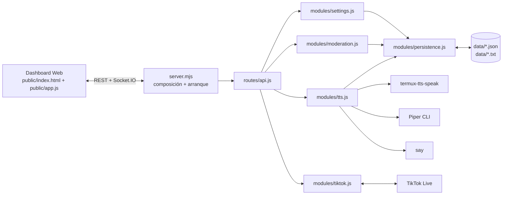
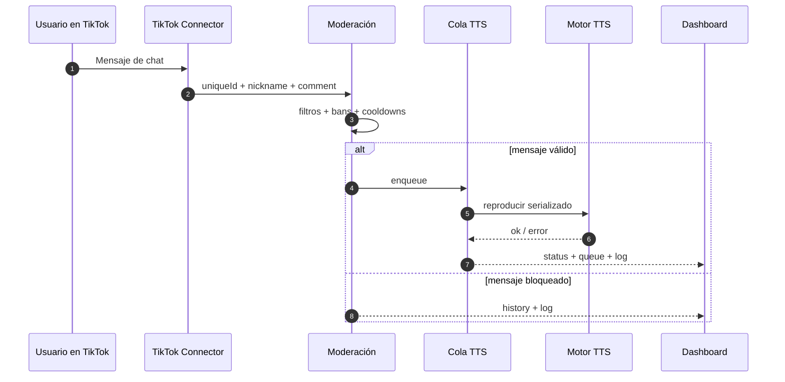

# TikTok TTS Dashboard

Dashboard local para leer chat de TikTok Live, moderarlo y reproducir TTS desde una UI web. El foco principal del proyecto es **Termux/Android**, manteniendo compatibilidad básica con `piper` y `say` según el runtime.

## Qué hace
- Conecta a un live de TikTok por `tiktok-live-connector`.
- Filtra mensajes con reglas de moderación, cooldowns y auto-ban.
- Encola mensajes y los reproduce por TTS.
- Expone un dashboard web local con REST + Socket.IO.
- Permite configurar runtime, TikTok, TTS, Piper, Termux y moderación sin editar código.
- Persiste estado local en `data/` sin ensuciar Git.

## Stack
- Node.js ESM
- Express
- Socket.IO
- `tiktok-live-connector`
- Motores TTS: `termux-tts-speak`, `piper`, `say`

## Arquitectura


```mermaid
flowchart LR
  UI[Dashboard Web<br/>public/index.html + public/app.js]
  API[server.mjs<br/>composición + arranque]
  ROUTES[routes/api.js]
  SETTINGS[modules/settings.js]
  MOD[modules/moderation.js]
  TTS[modules/tts.js]
  TIKTOK[modules/tiktok.js]
  PERSIST[modules/persistence.js]
  FS[(data/*.json<br/>data/*.txt)]
  LIVE[TikTok Live]
  TERMUX[termux-tts-speak]
  PIPER[Piper CLI]
  SAY[say]

  UI <-->|REST + Socket.IO| API
  API --> ROUTES
  ROUTES --> SETTINGS
  ROUTES --> MOD
  ROUTES --> TTS
  ROUTES --> TIKTOK
  SETTINGS --> PERSIST
  MOD --> PERSIST
  TTS --> PERSIST
  PERSIST <--> FS
  TIKTOK <--> LIVE
  TTS --> TERMUX
  TTS --> PIPER
  TTS --> SAY
```

## Flujo principal


```mermaid
sequenceDiagram
  autonumber
  participant User as Usuario en TikTok
  participant TT as TikTok Connector
  participant MOD as Moderación
  participant Q as Cola TTS
  participant ENG as Motor TTS
  participant UI as Dashboard

  User->>TT: Mensaje de chat
  TT->>MOD: uniqueId + nickname + comment
  MOD->>MOD: filtros + bans + cooldowns
  alt mensaje válido
    MOD->>Q: enqueue
    Q->>ENG: reproducir serializado
    ENG-->>Q: ok / error
    Q-->>UI: status + queue + log
  else mensaje bloqueado
    MOD-->>UI: history + log
  end
```

## Estructura del repo

```text
.
├─ server.mjs
├─ routes/
│  └─ api.js
├─ modules/
│  ├─ common.js
│  ├─ moderation.js
│  ├─ persistence.js
│  ├─ settings.js
│  ├─ tiktok.js
│  └─ tts.js
├─ public/
│  ├─ index.html
│  └─ app.js
├─ tests/
│  ├─ moderation.test.js
│  ├─ settings.test.js
│  └─ tiktok.test.js
├─ scripts/
│  └─ lint.mjs
├─ data/
│  ├─ settings.example.json
│  ├─ banned_users.example.json
│  ├─ badwords_exact_es.txt
│  ├─ badwords_substring_es.txt
│  ├─ settings.json          # generado localmente
│  ├─ banned_users.json      # generado localmente
│  └─ piper/                 # opcional, local
├─ package.json
└─ README.md
```

## Requisitos

### Base
- Node.js 18+
- `npm install`

### Para Termux/Android
- Termux
- paquete `termux-api`
- app `Termux:API` instalada en Android
- conectividad de red para TikTok Live

### Opcional
- `piper` si quieres síntesis por WAV
- `say` en runtimes donde exista soporte real

## Inicio rápido

```bash
npm install
npm run dev
```

O en modo normal:

```bash
npm start
```

Por defecto el dashboard queda en:

```text
http://127.0.0.1:8787
```

## Scripts

| Script | Uso |
| --- | --- |
| `npm start` | arranca el servidor |
| `npm run dev` | arranca con `node --watch` |
| `npm test` | corre tests con `node --test` |
| `npm run lint` | chequeo liviano de sintaxis con `node --check` |

## Estado runtime y Git

El proyecto **separa código de estado local**.

### Versionado
Se conservan en el repo:
- `data/settings.example.json`
- `data/banned_users.example.json`
- `data/badwords_exact_es.txt`
- `data/badwords_substring_es.txt`

Se ignoran por Git:
- `data/settings.json`
- `data/banned_users.json`
- WAVs generados
- temporales runtime
- logs runtime
- `data/runtime/`
- `data/piper/`

### Bootstrap automático
En el arranque:
- si falta `data/settings.json`, se crea desde `data/settings.example.json`
- si falta `data/banned_users.json`, se crea desde `data/banned_users.example.json`
- las listas de palabras base se usan tal cual desde `data/*.txt`

## Configuración

### Archivo principal
- plantilla: `data/settings.example.json`
- archivo runtime real: `data/settings.json`

Ejemplo:

```json
{
  "tiktokUsername": "TU_USUARIO_SIN_ARROBA",
  "bindHost": "127.0.0.1",
  "port": 8787,
  "adminToken": "",
  "ttsEnabled": true,
  "globalCooldownMs": 9000,
  "perUserCooldownMs": 30000,
  "maxQueue": 6,
  "maxChars": 80,
  "maxWords": 14,
  "historySize": 25,
  "ttsEngine": "termux",
  "ttsVoice": "",
  "ttsRate": 1,
  "piper": {
    "modelPath": "",
    "lengthScale": 1,
    "volume": 1,
    "pythonCmd": "python"
  },
  "termux": {
    "engine": "",
    "language": "es",
    "region": "MX",
    "variant": "",
    "pitch": 1,
    "rate": 1,
    "stream": "MUSIC",
    "outputMode": "media",
    "coexistenceMode": "duck"
  },
  "autoBan": {
    "enabled": true,
    "strikeThreshold": 2,
    "banMinutes": 30
  }
}
```

### Campos de runtime relevantes

| Campo | Descripción |
| --- | --- |
| `tiktokUsername` | usuario del live, sin `@` |
| `bindHost` | `127.0.0.1`, `localhost` o `0.0.0.0` |
| `port` | puerto HTTP del dashboard |
| `adminToken` | token simple para superficie admin cuando el bind no es loopback |

### Campos TTS relevantes

| Campo | Descripción |
| --- | --- |
| `ttsEngine` | `termux`, `piper`, `say` |
| `ttsRate` | velocidad general |
| `ttsVoice` | voz para `say`, si aplica |
| `piper.*` | modelo, escala, volumen y comando Python |
| `termux.*` | engine, locale, stream, pitch, rate y modo de audio |

### Persistencia efectiva de Termux TTS
El runtime mezcla configuración en este orden:
1. defaults internos
2. `data/settings.json`
3. overrides de sesión en memoria
4. overrides por request de prueba o cola local

## Seguridad mínima

### Regla actual
- si el servidor corre en `127.0.0.1` o `localhost`, la superficie admin se permite sin token
- si corre fuera de loopback, se exige `x-admin-token`

### Recomendación
Si vas a usar `bindHost=0.0.0.0`:
1. configura `adminToken`
2. reinicia el servidor
3. entra al dashboard con ese token

### Endpoints protegidos
Se protegen, entre otros:
- `/api/settings`
- `/api/tts/*`
- `/api/tiktok/*`
- `/api/ban`
- `/api/unban`
- `/api/lists`
- `/api/queue/*`

## Dashboard

El panel permite:
- conectar y desconectar TikTok
- activar o desactivar TTS
- ver cola, historial y logs
- editar listas de palabras
- administrar bans
- configurar `TikTok username`, `bindHost`, `port` y `adminToken`
- configurar Termux TTS, Piper y auto-ban
- probar voz desde la UI

## API

Base por defecto:

```text
http://127.0.0.1:8787
```

### Estado y runtime
- `GET /api/runtime`
- `GET /api/status`
- `POST /api/tts`

### Settings
- `GET /api/settings`
- `POST /api/settings`

`POST /api/settings` centraliza guardado lógico de:
- runtime
- TTS general
- Piper
- Termux
- auto-ban

Si cambias `bindHost` o `port`, el backend responde `restartRequired: true`; no hay hot-reload falso del servidor HTTP.

### TikTok
- `GET /api/tiktok/status`
- `POST /api/tiktok/connect`
- `POST /api/tiktok/disconnect`

El estado TikTok preserva `lastError` cuando falla la conexión inicial, para que la UI muestre la causa real del fallo.

### TTS
- `GET /api/tts/voices`
- `GET /api/tts/config`
- `POST /api/tts/config`
- `POST /api/tts/config/validate`
- `POST /api/tts/test`

### Cola
- `POST /api/queue/clear`
- `POST /api/queue/skip`
- `POST /api/queue/test`

### Moderación
- `GET /api/bans`
- `POST /api/ban`
- `POST /api/unban`
- `GET /api/lists`
- `POST /api/lists`
- `POST /api/badwords/add`

## Moderación

Se aplican, entre otras, estas reglas:
- bloqueo de URLs, emails, teléfonos y menciones
- detección de spam repetitivo
- listas de badwords exactas y por substring
- cooldown global
- cooldown por usuario
- auto-ban por strikes

## Motores TTS

### `termux`
Motor recomendado en Android/Termux.

Ventajas:
- integración más natural con el entorno objetivo
- configurable desde la UI
- validación de engines disponibles cuando `termux-tts-engines` existe

### `piper`
Útil para síntesis local basada en modelo.

Consideraciones:
- requiere modelo `.onnx`
- requiere reproductor WAV disponible en el runtime
- la ruta del modelo es local y normalmente no se versiona

### `say`
Se mantiene como compatibilidad secundaria fuera de Android. En Termux no es el camino principal.

## Calidad mínima integrada

El repo ya incluye una base liviana de calidad:
- tests con `node:test`
- lint liviano por sintaxis con `node --check`

Cobertura actual de tests:
- filtros de moderación
- cooldown global y por usuario
- validación de settings
- preservación del error de conexión TikTok

## Verificación rápida

```bash
npm run lint
npm test
npm start
```

## Troubleshooting

### El dashboard no conecta a TikTok
- revisa `tiktokUsername`
- no uses `@`
- valida conectividad de red
- revisa `lastError` en la UI o `GET /api/tiktok/status`

### Cambié `bindHost` o `port` y no se aplicó
Es esperado. Debes reiniciar el proceso si `restartRequired` es `true`.

### Estoy en `0.0.0.0` y no puedo usar el dashboard
Probablemente falta `adminToken` o es incorrecto. Configúralo en `data/settings.json` o desde loopback, reinicia y vuelve a entrar con ese token.

### Piper no suena
Revisa:
- `piper.modelPath`
- disponibilidad del reproductor WAV en el runtime
- permisos y existencia del modelo local

## Limitaciones conocidas
- no existe integración nativa Android para `AudioFocus`
- `duck` y `pause` son best-effort desde Termux/Web, no control total del sistema
- la detección de compatibilidad exacta engine/locale en Termux es limitada
- `say` no es una opción real en Android/Termux

## Desarrollo

### Flujo recomendado
```bash
npm install
npm run lint
npm test
npm run dev
```

### Si vienes de versiones anteriores
- conserva tus archivos locales en `data/`
- `data/banned_users.json` puede haber estado trackeado en versiones previas; ahora debe tratarse como estado local
- si borras archivos runtime, el servidor los recrea desde las plantillas `*.example.json`

## Licencia

No se definió licencia en este repo. Si vas a publicarlo o redistribuirlo, añade una explícita.
