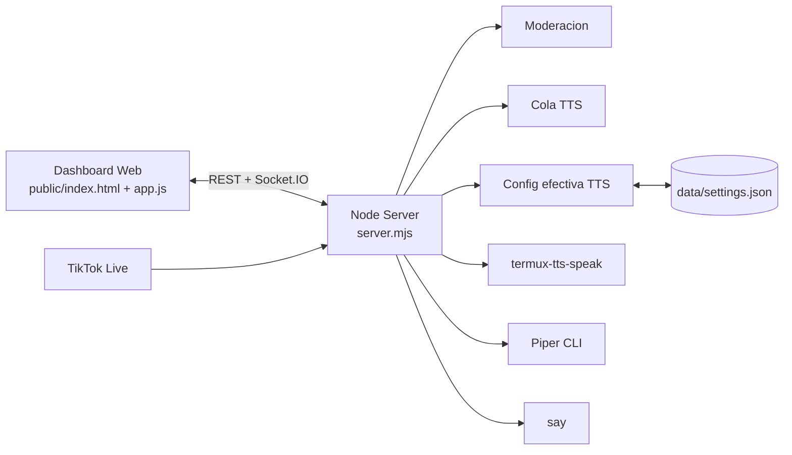
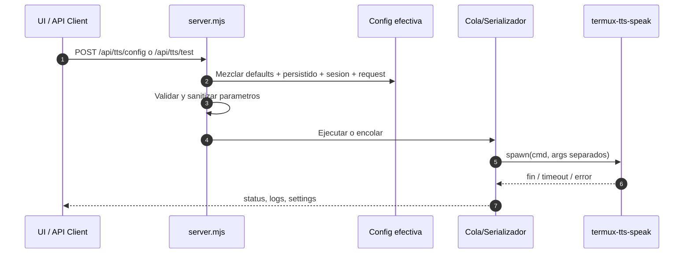
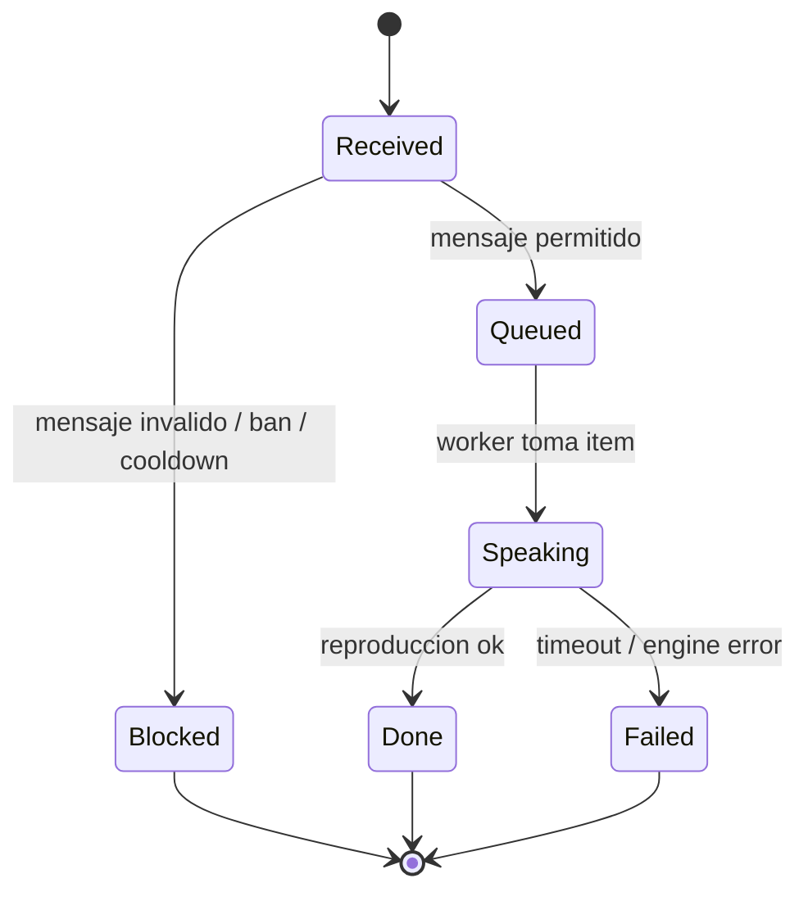

# TikTok TTS Dashboard para Termux/Android

Dashboard local en Node.js para leer chat de TikTok Live, moderarlo y reproducir TTS desde Termux con una UI web local. El proyecto ahora está orientado a Termux/Android como caso principal, sin perder compatibilidad básica con otros motores como `say` y `piper`.

## Resumen
- Backend único en `server.mjs` con Express + Socket.IO.
- Frontend estático en `public/index.html` y `public/app.js`.
- Persistencia local en `data/settings.json` y archivos de moderación en `data/`.
- Motores TTS soportados: `termux-tts-speak`, `piper`, `say`.
- Flujo TTS nuevo con configuración combinada: defaults del sistema + persistido + sesión + overrides por request.
- Panel UI para configurar Termux TTS sin depender solo de defaults hardcodeados.

## Arquitectura actual


```mermaid
flowchart LR
  UI[Dashboard Web<br/>public/index.html + app.js] <-->|REST + Socket.IO| API[Node Server<br/>server.mjs]
  API --> MOD[Moderacion]
  API --> QUEUE[Cola TTS]
  API --> CFG[Config efectiva TTS]
  CFG <--> FS[(data/settings.json)]
  API --> TERMUX[termux-tts-speak]
  API --> PIPER[Piper CLI]
  API --> SAY[say]
  TIKTOK[TikTok Live] --> API
```

### Componentes
- `server.mjs`: servidor HTTP, sockets, moderación, cola, TTS, persistencia y endpoints.
- `public/index.html`: dashboard local.
- `public/app.js`: carga de estado, panel de configuración, validación, pruebas y acciones en vivo.
- `data/settings.json`: configuración persistida.
- `data/badwords_exact_es.txt`, `data/badwords_substring_es.txt`, `data/banned_users.json`: estado de moderación.

### Limitación estructural importante
Este repo no incluye una capa nativa Android en Java/Kotlin. Eso significa que no hay control real de `AudioFocus` ni `AudioAttributes` del sistema desde código nativo. La mejora de convivencia de audio se implementa como `best effort` desde Termux, principalmente usando `stream=MUSIC` y políticas de configuración claras.

## Flujo TTS


```mermaid
sequenceDiagram
  autonumber
  participant UI as UI / API Client
  participant API as server.mjs
  participant CFG as Config efectiva
  participant Q as Cola/Serializador
  participant TTS as termux-tts-speak

  UI->>API: POST /api/tts/config o /api/tts/test
  API->>CFG: Mezclar defaults + persistido + sesion + request
  API->>API: Validar y sanitizar parametros
  API->>Q: Ejecutar o encolar
  Q->>TTS: spawn(cmd, args separados)
  TTS-->>Q: fin / timeout / error
  Q-->>UI: status, logs, settings
```

## Requisitos
- Termux en Android.
- Node.js 18+.
- `termux-api` instalado.
- Paquete `Termux:API` instalado en Android.
- Para TikTok Live: conectividad de red y nombre de usuario válido sin `@`.

### Dependencias opcionales
- `piper` si quieres síntesis local por WAV.
- `say` en plataformas donde esté disponible.

## Ejecución

```bash
npm install
node server.mjs
```

Por defecto el dashboard queda en:

```text
http://127.0.0.1:8787
```

## Estructura del proyecto

```text
.
├─ server.mjs
├─ package.json
├─ public/
│  ├─ index.html
│  └─ app.js
├─ data/
│  ├─ settings.json
│  ├─ banned_users.json
│  ├─ badwords_exact_es.txt
│  └─ badwords_substring_es.txt
└─ README.md
```

## Configuracion

### Configuracion persistida principal
Archivo: `data/settings.json`

Ejemplo representativo:

```json
{
  "tiktokUsername": "TU_USUARIO_SIN_ARROBA",
  "bindHost": "127.0.0.1",
  "port": 8787,
  "ttsEnabled": true,
  "globalCooldownMs": 9000,
  "perUserCooldownMs": 30000,
  "maxQueue": 6,
  "maxChars": 80,
  "maxWords": 14,
  "historySize": 25,
  "ttsEngine": "termux",
  "ttsVoice": "",
  "ttsRate": 1,
  "piper": {
    "modelPath": "",
    "lengthScale": 1,
    "volume": 1,
    "pythonCmd": "python"
  },
  "termux": {
    "engine": "",
    "language": "es",
    "region": "MX",
    "variant": "",
    "pitch": 1,
    "rate": 1,
    "stream": "MUSIC",
    "outputMode": "media",
    "coexistenceMode": "duck"
  },
  "autoBan": {
    "enabled": true,
    "strikeThreshold": 2,
    "banMinutes": 30
  }
}
```

### Modelo efectivo de configuracion TTS
La configuracion aplicada a `termux-tts-speak` ya no depende solo de defaults hardcodeados. El orden real es:
1. defaults del sistema en `DEFAULT_SETTINGS`.
2. configuracion persistida en `data/settings.json`.
3. overrides de sesion en memoria.
4. overrides por request para pruebas o llamadas puntuales.

### Campos TTS Termux soportados
- `engine: string | null`
- `language: string | null`
- `region: string | null`
- `variant: string | null`
- `stream: string | null`
- `pitch: number`
- `rate: number`
- `outputMode: "media" | "notification" | "auto"`
- `coexistenceMode: "duck" | "pause" | "best-effort"`
- `persistScope: "global" | "session"`

## Panel UI
El panel lateral ahora incluye una seccion completa para Termux TTS:
- engine
- language
- region
- variant
- stream
- pitch
- rate
- modo de audio TTS
- compatibilidad con musica
- persistencia
- texto de prueba
- boton `Probar voz`
- boton `Guardar`
- boton `Restaurar por defecto`

### Comportamiento esperado del panel
- carga los valores actuales desde backend.
- valida rangos y enums en backend.
- muestra warnings si la deteccion real del engine/idioma no es verificable por Termux.
- permite guardar globalmente o solo para la sesion actual.
- permite probar una frase corta con la configuracion seleccionada.

## API HTTP
Base local:

```text
http://127.0.0.1:8787
```

### Runtime y estado
- `GET /api/runtime`
- `GET /api/status`
- `POST /api/tts`

### Configuracion general
- `GET /api/settings`
- `POST /api/settings`

### Configuracion TTS Termux
- `GET /api/tts/config`
- `POST /api/tts/config`
- `POST /api/tts/config/validate`
- `POST /api/tts/test`
- `GET /api/tts/voices`

### Cola
- `POST /api/queue/clear`
- `POST /api/queue/skip`
- `POST /api/queue/test`

### TikTok
- `GET /api/tiktok/status`
- `POST /api/tiktok/connect`
- `POST /api/tiktok/disconnect`

### Moderacion
- `GET /api/bans`
- `POST /api/ban`
- `POST /api/unban`
- `GET /api/lists`
- `POST /api/lists`
- `POST /api/badwords/add`

## Contratos relevantes

### `GET /api/tts/config`
Devuelve snapshot de configuracion TTS Termux:
- `defaults`
- `persisted`
- `session`
- `effective`
- `persistScope`
- `validation`
- `audioBehavior`
- `runtime`

### `POST /api/tts/config`
Guarda configuracion TTS Termux.

Ejemplo:

```json
{
  "engine": "",
  "language": "es",
  "region": "MX",
  "variant": "",
  "stream": "MUSIC",
  "pitch": 1,
  "rate": 1,
  "outputMode": "media",
  "coexistenceMode": "duck",
  "persistScope": "session"
}
```

### `POST /api/tts/config/validate`
Valida payload sin persistir.

### `POST /api/tts/test`
Lanza una prueba TTS temporal con overrides por request.

Ejemplo:

```json
{
  "text": "Prueba de voz",
  "language": "es",
  "region": "MX",
  "outputMode": "media",
  "coexistenceMode": "duck",
  "enqueueIfBusy": true
}
```

## Audio en Termux/Android

### Objetivo funcional implementado
- El TTS ya puede salir por audio multimedia usando `MUSIC` cuando `outputMode=media`.
- Se evita depender del canal de notificaciones para el caso principal.
- Se liberan los procesos al terminar o al expirar timeout.
- Se evita el solapamiento de reproducciones mediante serializacion.

### Lo que si se logra hoy
- Priorizar `MUSIC` para un comportamiento mas parecido a voz multimedia.
- Exponer politicas de coexistencia en UI y backend.
- Mantener `best effort` realista en Termux.
- No cortar el flujo actual si faltan parametros.

### Lo que no se puede prometer en esta arquitectura
- Ducking garantizado del sistema sobre YouTube o Spotify.
- Pausa/reanudacion real de otras apps.
- Manejo nativo de `AudioFocus` transitorio tipo `may duck`.

Eso requeriria una integracion nativa Android fuera del alcance actual del repo.

## Robustez y seguridad
- Ejecucion de `termux-tts-speak` con `spawn` y argumentos separados.
- Sanitizacion de `engine`, `language`, `region`, `variant` y `stream`.
- Validacion defensiva de `pitch` y `rate`.
- Timeouts para evitar procesos colgados.
- Cola TTS serializada para evitar race conditions.
- Respuesta `409 tts_busy` para pruebas si ya hay una reproduccion activa.
- Opcion `enqueueIfBusy=true` para encolar pruebas cuando el TTS este ocupado.
- Logs de error utiles sin volcar payloads completos innecesarios.

## Moderacion y cola


```mermaid
stateDiagram-v2
  [*] --> Received
  Received --> Blocked: mensaje invalido / ban / cooldown
  Received --> Queued: mensaje permitido
  Queued --> Speaking: worker toma item
  Speaking --> Done: reproduccion ok
  Speaking --> Failed: timeout / engine error
  Blocked --> [*]
  Done --> [*]
  Failed --> [*]
```

### Reglas generales
- filtro de URLs, emails, telefonos, menciones y spam.
- badwords exactas y por substring.
- cooldown global y por usuario.
- auto-ban configurable por strikes.

## Pruebas manuales recomendadas
1. Iniciar musica en Spotify y ejecutar `Probar voz` con `outputMode=media`.
2. Reproducir YouTube y probar `coexistenceMode=duck` y `best-effort`.
3. Silenciar notificaciones del sistema y confirmar que `media` sigue sonando.
4. Cambiar `language` y `region` de `es/MX` a otro valor valido y probar.
5. Cambiar `pitch` y `rate` y verificar diferencias auditivas.
6. Cambiar `stream` explicitamente a `NOTIFICATION` y comparar comportamiento.
7. Probar `engine` no detectado y revisar warning en UI.
8. Enviar `pitch=9` o `rate=0.1` por validacion y confirmar error.
9. Lanzar varias pruebas consecutivas para confirmar serializacion.
10. Probar `persistScope=session`, reiniciar servidor y verificar que no persiste en archivo.
11. Probar `persistScope=global`, reiniciar servidor y verificar que si persiste.

## Desarrollo y mantenimiento

### Verificacion rapida
```bash
node --check server.mjs
node --check public/app.js
node server.mjs
```

### Archivos clave
- `server.mjs`
- `public/index.html`
- `public/app.js`
- `data/settings.json`

## Limitaciones conocidas
- La deteccion de soporte real por engine/idioma/región/variante en Termux es limitada.
- `termux-tts-engines` ayuda a detectar engines, pero no expone una matriz completa de compatibilidad de voces/locales.
- `say` no es una opcion real en Android/Termux.
- `piper` puede requerir configuracion adicional de modelo y reproductor WAV.

## Roadmap sugerido
- Integracion nativa Android para `AudioFocus` real.
- Presets por usuario o por escenario.
- Historial de configuraciones TTS.
- Exportar/importar configuracion.
- Tests automatizados de contratos API.
